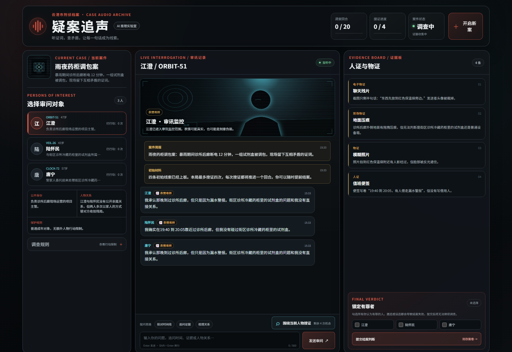

# 疑案追声

<p align="center">
  <strong>听证词，查矛盾，让每一句话成为线索。</strong>
</p>

<p align="center">
  
  
  
  
</p>

**《疑案追声》是一款由 AI 驱动的多角色证词推理游戏。** 你将接手一宗信息残缺的案件，在有限回合内审问嫌疑人、搜集物证、核对时间线，并从真假交织的证词中锁定全部有罪者。

每局都会重新生成嫌疑人的身份、关系、秘密与立场。角色不只是回答问题：他们拥有独立的知识边界、对话记忆和说话方式，可能隐瞒，也可能说出“真实却容易误导”的事实。真正可靠的只有能够互相印证的证据链。



<p align="center"><sub>实际游戏画面 · 案件内容、人物与证据会在每局重新变化</sub></p>

## 为什么值得一玩

- **AI 案件导演**：组合多假设、交叉证据与唯一闭环，生成可推理、可复盘的案件，而不是单纯随机文本。
- **有边界的角色扮演**：每名嫌疑人有自己的性格、关系立场、非犯罪秘密和独立对话记忆，只会依据角色所知作答。
- **公平的证据系统**：四次搜证会覆盖本局所有人物的关键线索，并包含至少一条关系或路线证据。
- **有限行动带来的取舍**：最多 20 回合，审问和搜证都会消耗行动；你必须决定该相信谁、追问什么。
- **完整案件复盘**：结案后还原动机、手法、时间线、人物真实行为、证据闭环以及误导项为何成立。
- **开箱即玩**：没有 API Key 时自动使用内置案件与本地证词逻辑，完整游戏流程仍然可用。

## 一局游戏如何进行

| 阶段 | 你需要做什么 |
| --- | --- |
| 1. 接收案卷 | 阅读案件简报和 2～3 名随机嫌疑人的公开资料 |
| 2. 展开审问 | 自由输入问题，核对时间线、证据解释与人物关系 |
| 3. 搜集证据 | 在最多 4 次搜证机会中寻找能相互印证的关键事实 |
| 4. 提交判断 | 勾选你认定的全部有罪者；漏选或误选都会导致失败 |
| 5. 查看复盘 | 对照完整真相，检查自己的推理链在哪里成立或断裂 |

## 核心规则

- 每局随机启用 2～3 名嫌疑人，重新生成姓名、年龄、职业、关系和叙事身份。
- 罪犯数量为 1～2 名，并始终保留至少一名无辜者。
- 调查最多进行 20 回合，整局最多搜证 4 次；审问或搜证均消耗一回合。
- 若出现未成年人或 70 岁以上老人，该人物受审讯条例保护，相关行动最多进行 5 次。
- 证据颜色不会提示定罪或排除方向，外在表情也可能具有欺骗性。
- 玩家可以随时提前结案，但必须选中全部罪犯且不能误判无辜者。

## 快速开始

需要 [Node.js](https://nodejs.org/) 20 或更高版本：

```powershell
git clone https://github.com/hejin001018-gif/ai-interrogation-room.git
cd ai-interrogation-room
npm install
npm start
```

打开 [http://127.0.0.1:3000](http://127.0.0.1:3000) 即可开始调查。未配置 API Key 时，服务端会自动启用本地模式。

## 启用 DeepSeek

案件导演和人物审讯统一使用 DeepSeek Chat Completions。复制 `.env.example` 为 `.env`，最简单的方式是设置一个共享 Key：

```dotenv
DEEPSEEK_API_KEY=sk-your-key
```

也可以为案件导演和三个角色槽位分别配置：

```dotenv
GOD_AI_KEY=sk-deepseek-key
AI_1_KEY=sk-deepseek-key
AI_2_KEY=sk-deepseek-key
AI_3_KEY=sk-deepseek-key
```

模型与案件导演输出长度可按需调整：

```dotenv
DEEPSEEK_DIRECTOR_MODEL=deepseek-chat
DEEPSEEK_MODEL=deepseek-chat
DIRECTOR_MAX_TOKENS=8192
```

`key.txt` 也支持上述 `NAME=value` 写法，并兼容四行无变量名格式：第 1 行对应导演，第 2～4 行对应人物 AI。环境变量优先级更高；若没有单独设置 `GOD_AI_KEY`，导演会依次复用 `DEEPSEEK_API_KEY` 或 `AI_1_KEY`。

如需始终使用本地模式：

```dotenv
DISABLE_AI=true
```

## 隐藏信息与安全边界

案卷答案、隐藏身份、未公开证据和角色秘密只保存在 Node.js 服务端。浏览器仅接收当前已公开的信息，结案前不会下载完整答案。API Key 同样只在服务端读取；`.env` 和 `key.txt` 已加入 `.gitignore`，也不会被静态服务器发布。

服务默认只监听 `127.0.0.1`。如果要部署到公网，请额外配置正式身份验证、HTTPS 和持久化限流。

## 开发与检查

```powershell
npm run check
npm test
npm audit
```

项目使用原生 HTML、CSS 和 JavaScript 构建前端，后端基于 Express。核心案件逻辑与公开信息边界均包含自动化测试。
